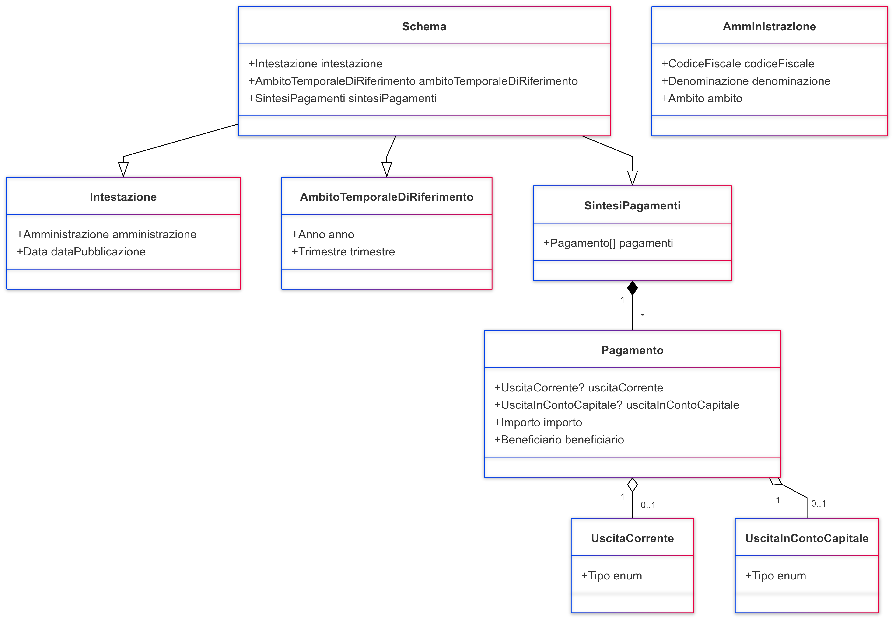

Schema Allegato articolo 4 bis
==============================

La norma

1. L'Agenzia per l'Italia digitale, d'intesa con il Ministero dell'economia e
delle finanze, al fine di promuovere l'accesso e migliorare la comprensione dei
dati relativi all'utilizzo delle risorse pubbliche, gestisce il sito internet
denominato "Soldi pubblici" che consente l'accesso ai dati dei pagamenti delle
pubbliche amministrazioni e ne permette la consultazione in relazione alla
tipologia di spesa sostenuta e alle amministrazioni che l'hanno effettuata, nonché
all'ambito temporale di riferimento.

2. Ciascuna amministrazione pubblica sul proprio sito istituzionale, in una parte
chiaramente identificabile della sezione "Amministrazione trasparente", i dati
sui propri pagamenti e ne permette la consultazione in relazione alla tipologia
di spesa sostenuta, all'ambito temporale di riferimento e ai beneficiari.

3. Per le spese in materia di personale si applica quanto previsto dagli articoli
da 15 a 20.

4. Dalle disposizioni di cui ai commi 1 e 2 non devono derivare nuovi o maggiori
oneri a carico della finanza pubblica. Le amministrazioni interessate provvedono
ai relativi adempimenti nell'ambito delle risorse umane, strumentali e finanziarie
disponibili a legislazione vigente.

Questo schema organizza e standardizza la pubblicazione delle informazioni finanziarie relative ai pagamenti effettuati dalle amministrazioni pubbliche.

*Diagramma delle classi per lo schema dell'articolo 4 bis*

Schema: art4-bis-v1.0.0
Questo schema organizza e standardizza la pubblicazione delle informazioni finanziarie relative ai pagamenti effettuati dalle amministrazioni pubbliche.
Dettagli dei Campi

- Intestazione (Oggetto, Obbligatorio): Contiene le informazioni identificative dell'amministrazione pubblicatrice.
- Ambito Temporale di Riferimento (Oggetto, Obbligatorio): Indica il periodo di riferimento dei dati riportati.
- Sintesi Pagamenti (Array di Oggetti, Obbligatorio): Elenco dei pagamenti effettuati, classificati in categorie.