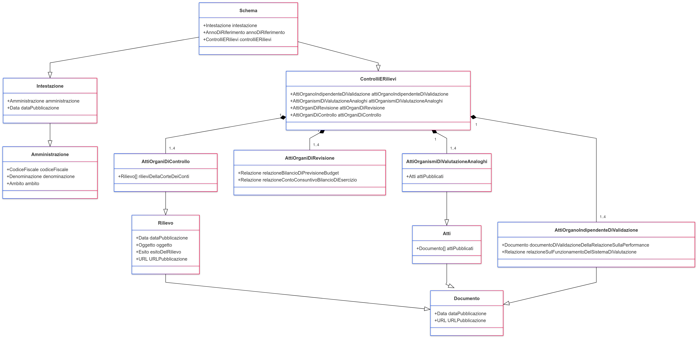

Schema Allegato articolo 31
===========================

Diagramma delle Classi del JSON Schema
--------------------------------------

Il diagramma seguente illustra la struttura complessiva del JSON Schema utilizzato per la documentazione e la pubblicazione dei dati finanziari da parte delle amministrazioni pubbliche. Questo diagramma delle classi è stato creato utilizzando Mermaid, uno strumento che facilita la visualizzazione grafica delle relazioni tra le varie componenti dello schema.

Questo strumento visivo aiuta gli sviluppatori e gli analisti a comprendere rapidamente la struttura del documento JSON e le relazioni tra i suoi vari componenti. Ogni classe nel diagramma rappresenta un oggetto nel JSON Schema, con le sue proprietà e le relazioni tra gli oggetti indicati chiaramente. Le classi sono collegate in modo da riflettere l'annidamento e le dipendenze tra i dati nel documento JSON finale.

**Utilità del Diagramma**:
- **Chiarezza Strutturale**: Fornisce una rappresentazione visiva della struttura dei dati, rendendo più intuitiva la comprensione delle relazioni e delle dipendenze.
- **Facilitazione dello Sviluppo**: Aiuta gli sviluppatori nella codifica e nella verifica dei dati per assicurare che il JSON finale rispetti lo schema definito.
- **Documentazione e Formazione**: Serve come strumento eccellente per la formazione di nuovi sviluppatori o analisti che lavorano con questi dati, accelerando il loro processo di apprendimento.

Incorpora il diagramma nel contesto della documentazione completa per fornire ai lettori una guida visiva che complemente le descrizioni tecniche dettagliate dei campi e delle funzionalità dello schema.

.. mermaid::

    %%{init: {'theme': 'default'}}%%
    classDiagram
        Class01 <|-- Class02
        Class03 *-- Class04
        Class05 o-- Class06
        Class07 .. Class08
        Class09 --|> Class10

Sostituisci il codice Mermaid con il diagramma effettivo per visualizzare la struttura del tuo JSON Schema.

*Diagramma delle classi*